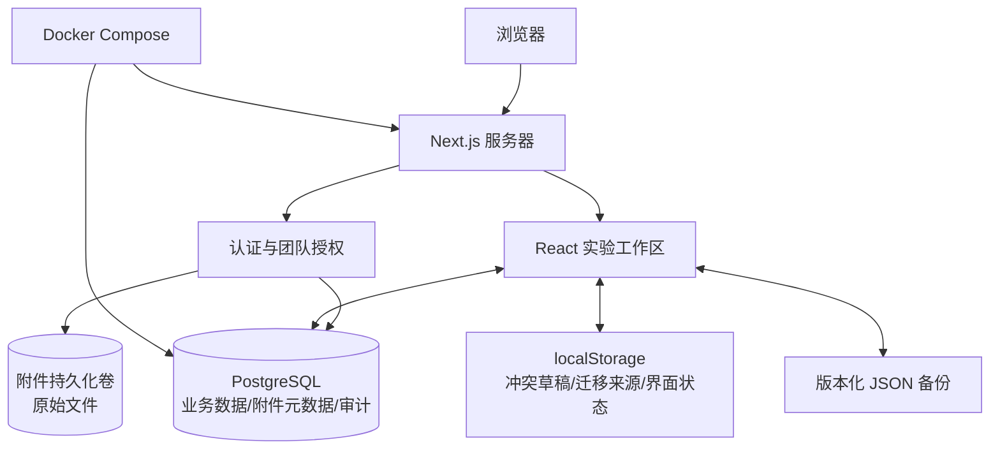

# Atlas ELN 项目架构说明

> 基线日期：2026-08-13。本文描述仓库当前真实实现，而非最终目标。

## 1. 产品定位与已确认边界

Atlas ELN 用于管理分层实验计划、计划间依赖、Markdown 实验正文和关键事件记录。测试版边界如下：

- 只允许管理员创建的团队账户登录；
- 一个计划对应一次实验，不引入实验批次实体；
- 角色为 `owner/member`，成员可编辑团队内全部实验数据；
- Markdown 是实验正文，`Entry` 是关键事件时间线；
- 附件类型不限，单文件上限 20 MB、团队总量上限 1 GB；
- 不承诺电子签名、审批、法规合规或离线多端同步。

## 2. 当前总体架构



这是一个过渡架构。登录、团队身份、项目、计划、依赖、Markdown 正文和 Entry 已经服务端化，同一团队成员换浏览器后会看到同一计划树、网络图、正文和事件时间线。界面偏好仍保存在各浏览器本地。

## 3. 目录结构

```text
nln/
├── app/
│   ├── admin/users/                # owner 的成员账户管理页面
│   ├── api/
│   │   ├── admin/users/            # 创建、停用、启用、重置密码
│   │   ├── auth/                   # 登录、退出、修改密码
│   │   ├── health/                 # 应用与数据库健康检查
│   │   └── workspace/              # 团队项目读取和版本化快照写入
│   ├── change-password/            # 首次登录强制改密页面
│   ├── data/seed.ts                # 演示数据
│   ├── features/
│   │   ├── dependencies/           # 可达性和有向环检测
│   │   ├── notebook/               # Markdown 块编解码
│   │   ├── persistence/            # 本地仓储、备份格式和校验
│   │   ├── plans/                  # 计划树、后代和移动约束
│   │   └── workspace/              # 领域类型与枚举
│   ├── lib/auth/                   # 密码、会话和审计帮助函数
│   ├── lib/workspace/              # 项目授权边界与快照查询
│   ├── login/                      # 登录页
│   ├── page.tsx                    # 受保护的服务端入口
│   ├── workspace-client.tsx        # 当前实验工作区客户端实现
│   ├── layout.tsx                  # 根布局和元数据
│   └── globals.css                 # 全局样式
├── db/
│   ├── schema.ts                   # PostgreSQL 认证、团队和实验计划 Schema
│   └── index.ts                    # postgres-js 与 Drizzle 连接
├── drizzle/                        # 受版本控制的 SQL 迁移和元数据
├── scripts/bootstrap-admin.ts      # 幂等创建首个 owner 和团队
├── tests/                          # 领域、持久化和密码单元测试
├── docs/                           # 架构、部署、迁移计划和 ADR
├── Dockerfile                      # Next.js standalone 多阶段镜像
├── compose.yaml                    # Web + PostgreSQL 单机编排
├── instrumentation.ts              # 容器启动时应用数据库迁移
├── drizzle.config.ts               # PostgreSQL 迁移生成配置
└── next.config.ts                  # standalone 输出配置
```

`.next/`、`node_modules/` 等是生成物，不属于业务源代码。

## 4. 技术栈与运行原理

| 层 | 技术 | 职责 |
| --- | --- | --- |
| 页面/服务端 | Next.js 16 App Router | 服务端身份门禁、页面和 Route Handler |
| 客户端 | React 19 | 工作区交互和浏览器状态 |
| 图形 | `@xyflow/react` | 计划节点和依赖边 |
| 数据库 | PostgreSQL 17 | 账号、团队、项目、计划、依赖、会话和审计 |
| ORM/驱动 | Drizzle ORM + postgres-js | 类型化查询、Schema 和迁移 |
| 密码 | Node `scrypt` | 加盐密码派生和恒定时间比较 |
| 部署 | Docker Compose | 单机 Web 与数据库生命周期 |
| 测试 | Node test runner + Next build | 纯逻辑回归和生产编译门禁 |

Next.js 在根页面执行 `requireUser()`。未登录用户跳转到 `/login`，临时密码用户跳转到 `/change-password`，owner 才能进入 `/admin/users`。写接口重新从 HttpOnly 会话 Cookie 解析用户，不信任客户端提交的角色或用户 ID。

## 5. 服务端身份与权限模型

### 5.1 表结构

- `users`：邮箱、显示名、scrypt 密码哈希、是否强制改密、是否停用；
- `teams`：团队名称和创建者；
- `team_members`：用户与团队的联合主键及 `owner/member` 角色；
- `sessions`：仅保存随机令牌的 SHA-256 哈希、过期时间和用户关系；
- `audit_events`：记录登录、创建账户、重置密码、停用等关键管理动作。

首个管理员由部署者通过环境变量和 `npm run admin:bootstrap` 创建。后续成员由 owner 在页面中创建；系统生成临时密码，只在响应页面展示一次。重置密码会撤销该成员的全部现有会话。

### 5.2 会话

登录成功后，服务器生成 256 位随机令牌，浏览器只得到 HttpOnly、SameSite=Lax Cookie，数据库只保存令牌哈希。默认有效期 7 天。生产 HTTPS 环境应使用 `COOKIE_SECURE=true`；仅在 SSH 隧道/VPN 的 HTTP 测试中使用 `false`。

### 5.3 当前安全边界

已实现：服务端页面门禁、角色检查、强制改密、停用账户、会话撤销、密码加盐哈希、审计事件，以及 Nginx 登录接口按来源地址限速。

尚未实现：MFA、找回密码、审计查看页、CSRF Origin 显式校验和细粒度项目权限。当前公网 IP HTTP 入口只用于短期基础功能测试，链路不加密，不得使用敏感或复用密码；正式使用前必须切换 HTTPS 并完成剩余安全增强。

## 6. 实验工作区领域模型与服务器同步

### Plan

计划通过 `parentId` 邻接表形成树；包含标题、领域、状态、目标、成功标准、标签、日期及网络图坐标。移动计划前检查目标不是自身或后代。

### Dependency

`sourceId -> targetId` 表示执行依赖，与父子层级相互独立。新增边前执行可达性检查，防止形成有向环。

计划与依赖现在以 PostgreSQL 为唯一事实源。客户端加载 `/api/workspace`；修改后等待 650ms，将当前计划/依赖快照提交给服务器。服务器在单个事务中获取项目锁、比较项目版本、重新验证计划层级和依赖图、增量写入关系表，并递增版本。版本不一致时返回冲突，要求用户刷新，不会静默覆盖其他成员的数据。

当前按完整快照提交适合小团队内测。数据规模或并发频率显著增加后，可改为命令式增量 API，同时保留项目版本和服务端事务约束。

### Notebook 与 Entry

当前每个计划在 `documents` 表保存一份 Markdown。编辑器把 Markdown 转换为标题、段落、列表、任务、引用、代码、分隔线和图片等块，编辑后再序列化。`Entry` 在独立时间线中展示，并保存到 `entries` 表。两类内容均使用版本条件避免静默覆盖。

## 7. 当前本地与服务器读写方案

`WorkspaceRepository` 继续负责本地草稿和完整 JSON 文件；计划与依赖不再从它恢复为事实源。当前流程：

1. 页面从服务器读取团队项目、计划和依赖；
2. 从服务器读取 Markdown 和 Entry，从本地读取展开状态、画布偏好及未解决冲突草稿；
3. 计划、依赖、Markdown 和 Entry 变化写入服务器，本地只保留迁移来源和可导出缓存；
4. 导出 `atlas-eln-backup` JSON 完整快照；
5. 导入前校验并确认，计划、依赖、文档和 Entry 写入团队服务器。

升级前已有浏览器本地计划而团队项目为空时，界面会显示“迁移本机计划”；服务器内容为空且本机有 Markdown/Entry 时会显示“迁移本机文档”。两者均由用户确认后一次性写入服务器，不会在后台自动覆盖团队数据。

新上传图片先写入附件持久化卷，再把受团队权限保护的内容地址写入 Markdown；数据库只保存文件名、类型、大小、SHA-256、存储键和归属计划。升级前已存在的 Base64 图片仍可显示，但建议逐步重新上传。`AttachmentStorage` 将本机卷实现与 API 解耦，后续可切换 S3/OBS。

## 8. 数据库迁移与容器启动

`db/schema.ts` 是结构定义，`drizzle/*.sql` 是不可随意改写的迁移历史。应用进程启动时，`instrumentation.ts` 在 Node 运行时调用 Drizzle migrator；迁移完成后才继续启动。`/api/health` 同时验证 Web 进程和数据库连接。

Compose 中 PostgreSQL 不映射宿主机端口，Nginx 临时绑定公网 80，并保留 `127.0.0.1:3000` 作为本机诊断入口；Web 仅在容器网络提供服务。附件存放在独立命名卷 `attachment_data`，3000 和 5432 不应加入公网安全组。

## 9. 架构优化判断

当前从单文件原型到“领域纯函数 + 本地仓储 + 服务端身份”的拆分方向合理，不建议一次性重写。后续优先级：

1. 完善旧 JSON 的导入预览、批次记录和幂等校验；
2. 把大型 `workspace-client.tsx` 继续拆成工具栏、树、图、详情抽屉和编辑器组件；
3. 增加登录限速、Origin/CSRF 防护、恢复演练、监控和端到端权限测试；
4. 为附件增加异机备份、恶意文件检测和生命周期策略；
5. 根据真实容量把 `AttachmentStorage` 从本机卷切换为对象存储。

2 核 2 GB 主机可以承载小团队测试，但应保持单 Web 实例、小连接池，并为系统配置交换空间。镜像最好在开发机或 CI 构建后推送，避免服务器构建阶段内存不足。

## 10. 仍需以后确认的产品问题

- 删除计划是软删除、回收站还是永久删除；
- 是否需要不可篡改历史、审批、签名或受监管合规；
- 附件的真实单文件大小、总容量、保留期和备份目标；
- 团队成员是否最终需要只读或项目级隔离；
- 服务器实验数据是否需要应用层加密。

这些问题不阻塞当前内测，但会改变正式数据模型和运维成本，应在对应功能实施前写入新的 ADR。
